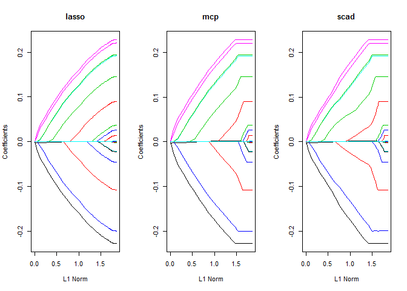

## Introduction

The oem package provides estimaton for various penalized linear models using the [Orthogonalizing EM algorithm](http://amstat.tandfonline.com/doi/abs/10.1080/00401706.2015.1054436). 

Install using the **devtools** package (RcppEigen must be installed first as well):

```r
devtools::install_github("jaredhuling/oem")
```

or by cloning and building using `R CMD INSTALL`

## Models

### Lasso


```r
library(microbenchmark)
library(glmnet)
library(oem)
# compute the full solution path, n > p
set.seed(123)
n <- 1000000
p <- 100
m <- 25
b <- matrix(c(runif(m), rep(0, p - m)))
x <- matrix(rnorm(n * p, sd = 3), n, p)
y <- drop(x %*% b) + rnorm(n)

lambdas = oem(x, y, intercept = TRUE, standardize = FALSE, penalty = "elastic.net")$lambda

microbenchmark(
    "glmnet[lasso]" = {res1 <- glmnet(x, y, thresh = 1e-10, 
                                      standardize = FALSE,
                                      intercept = TRUE,
                                      lambda = lambdas)}, 
    "oem[lasso]"    = {res2 <- oem(x, y,
                                   penalty = "elastic.net",
                                   intercept = TRUE, 
                                   standardize = FALSE,
                                   lambda = lambdas,
                                   tol = 1e-10)},
    times = 5
)
```

```
## Unit: seconds
##           expr      min       lq     mean   median       uq      max neval
##  glmnet[lasso] 6.635937 7.424701 7.934848 8.037403 8.629343 8.946857     5
##     oem[lasso] 1.750004 1.766604 2.102396 1.922809 2.191261 2.881303     5
##  cld
##    b
##   a
```

```r
# difference of results
max(abs(coef(res1) - res2$beta[[1]]))
```

```
## [1] 1.048072e-07
```

```r
res1 <- glmnet(x, y, thresh = 1e-12, # thresh must be very low for glmnet to be accurate
                                      standardize = FALSE,
                                      intercept = TRUE,
                                      lambda = lambdas)

max(abs(coef(res1) - res2$beta[[1]]))
```

```
## [1] 3.763398e-09
```

### Nonconvex Penalties


```r
library(sparsenet)
library(ncvreg)
library(plus)
# compute the full solution path, n > p
set.seed(123)
n <- 5000
p <- 200
m <- 25
b <- matrix(c(runif(m, -0.5, 0.5), rep(0, p - m)))
x <- matrix(rnorm(n * p, sd = 3), n, p)
y <- drop(x %*% b) + rnorm(n)

mcp.lam <- oem(x, y, penalty = "mcp",
               gamma = 2, intercept = TRUE, 
               standardize = TRUE,
               nlambda = 200, tol = 1e-10)$lambda

scad.lam <- oem(x, y, penalty = "scad",
               gamma = 4, intercept = TRUE, 
               standardize = TRUE,
               nlambda = 200, tol = 1e-10)$lambda

microbenchmark(
    "sparsenet[mcp]" = {res1 <- sparsenet(x, y, thresh = 1e-10, 
                                          gamma = c(2,3), #sparsenet throws an error 
                                                          #if you only fit 1 value of gamma
                                          nlambda = 200)},
    "oem[mcp]"    = {res2 <- oem(x, y,  
                                 penalty = "mcp",
                                 gamma = 2,
                                 intercept = TRUE, 
                                 standardize = TRUE,
                                 nlambda = 200,
                                 tol = 1e-10)},
    "ncvreg[mcp]"    = {res3 <- ncvreg(x, y,  
                                   penalty = "MCP",
                                   gamma = 2,
                                   lambda = mcp.lam,
                                   eps = 1e-7)}, 
    "plus[mcp]"    = {res4 <- plus(x, y,  
                                   method = "mc+",
                                   gamma = 2,
                                   lam = mcp.lam)},
    "oem[scad]"    = {res5 <- oem(x, y,  
                                 penalty = "scad",
                                 gamma = 4,
                                 intercept = TRUE, 
                                 standardize = TRUE,
                                 nlambda = 200,
                                 tol = 1e-10)},
    "ncvreg[scad]"    = {res6 <- ncvreg(x, y,  
                                   penalty = "SCAD",
                                   gamma = 4,
                                   lambda = scad.lam,
                                   eps = 1e-7)}, 
    "plus[scad]"    = {res7 <- plus(x, y,  
                                   method = "scad",
                                   gamma = 4,
                                   lam = scad.lam)}, 
    times = 5
)
```


```
## Unit: milliseconds
##            expr       min        lq      mean    median        uq
##  sparsenet[mcp] 1548.6511 1552.3118 1567.0587 1565.7308 1583.1121
##        oem[mcp]  130.6808  137.6145  143.0323  139.4520  139.7125
##     ncvreg[mcp] 7432.4827 7817.9143 8068.5770 7970.7391 8401.4716
##       plus[mcp] 1573.0012 1576.4744 1775.4693 1732.3271 1974.1961
##       oem[scad]  110.6008  111.2703  127.7759  112.7292  128.4269
##    ncvreg[scad] 7869.2410 7882.4848 8254.1719 8051.6287 8583.3371
##      plus[scad] 1762.2800 1784.1954 1919.9492 1935.9817 2045.7789
##        max neval cld
##  1585.4879     5  b 
##   167.7016     5 a  
##  8720.2774     5   c
##  2021.3478     5  b 
##   175.8522     5 a  
##  8884.1679     5   c
##  2071.5101     5  b
```

```r
diffs <- array(NA, dim = c(4, 1))
colnames(diffs) <- "abs diff"
rownames(diffs) <- c("MCP:  oem and ncvreg", "SCAD: oem and ncvreg",
                     "MCP:  oem and plus", "SCAD: oem and plus")
diffs[,1] <- c(max(abs(res2$beta[[1]] - res3$beta)), max(abs(res5$beta[[1]] - res6$beta)),
               max(abs(res2$beta[[1]][-1,1:nrow(res4$beta)] - t(res4$beta))),
               max(abs(res5$beta[[1]][-1,1:nrow(res7$beta)] - t(res7$beta))))
diffs
```

```
##                          abs diff
## MCP:  oem and ncvreg 5.149270e-10
## SCAD: oem and ncvreg 2.089842e-10
## MCP:  oem and plus   2.268799e-11
## SCAD: oem and plus   1.426526e-11
```


### Group Lasso


```r
library(gglasso)
library(grpreg)
library(grplasso)
# compute the full solution path, n > p
set.seed(123)
n <- 5000
p <- 200
m <- 25
b <- matrix(c(runif(m, -0.5, 0.5), rep(0, p - m)))
x <- matrix(rnorm(n * p, sd = 3), n, p)
y <- drop(x %*% b) + rnorm(n)
groups <- rep(1:floor(p/10), each = 10)

grp.lam <- oem(x, y, penalty = "grp.lasso",
               groups = groups,
               nlambda = 100, tol = 1e-10)$lambda


microbenchmark(
    "gglasso[grp.lasso]" = {res1 <- gglasso(x, y, group = groups, 
                                            lambda = grp.lam, 
                                            intercept = FALSE,
                                            eps = 1e-8)},
    "oem[grp.lasso]"    = {res2 <- oem(x, y,  
                                       groups = groups,
                                       penalty = "grp.lasso",
                                       lambda = grp.lam,
                                       tol = 1e-10)},
    "grplasso[grp.lasso]"    = {res3 <- grplasso(x=x, y=y, 
                                                 index = groups,
                                                 standardize = FALSE, 
                                                 center = FALSE, model = LinReg(), 
                                                 lambda = grp.lam * n * 2, 
                                                 control = grpl.control(trace = 0, tol = 1e-10))}, 
    "grpreg[grp.lasso]"    = {res4 <- grpreg(x, y, group = groups, 
                                             eps = 1e-10, lambda = grp.lam)},
    times = 5
)
```

```
## Unit: milliseconds
##                 expr        min         lq       mean     median
##   gglasso[grp.lasso] 1569.36067 1601.78605 1599.42591 1603.33534
##       oem[grp.lasso]   64.95575   66.89069   67.58398   67.74526
##  grplasso[grp.lasso] 2333.77095 2364.55783 2373.53448 2380.90492
##    grpreg[grp.lasso]  926.51348  938.69110  941.85205  942.34704
##          uq        max neval  cld
##  1603.73401 1618.91351     5   c 
##    68.88049   69.44771     5 a   
##  2386.12238 2402.31632     5    d
##   947.29490  954.41374     5  b
```

```r
diffs <- array(NA, dim = c(2, 1))
colnames(diffs) <- "abs diff"
rownames(diffs) <- c("oem and gglasso", "oem and grplasso")
diffs[,1] <- c(  max(abs(res2$beta[[1]][-1,] - res1$beta)), max(abs(res2$beta[[1]][-1,] - res3$coefficients))  )
diffs
```

```
##                      abs diff
## oem and gglasso  1.382705e-07
## oem and grplasso 4.818586e-08
```

#### Bigger Group Lasso Example


```r
set.seed(123)
n <- 500000
p <- 200
m <- 25
b <- matrix(c(runif(m, -0.5, 0.5), rep(0, p - m)))
x <- matrix(rnorm(n * p, sd = 3), n, p)
y <- drop(x %*% b) + rnorm(n)
groups <- rep(1:floor(p/10), each = 10)

system.time(res <- oem(x, y, penalty = "grp.lasso",
                       groups = groups,
                       standardize = TRUE,
                       intercept = TRUE,
                       nlambda = 100, tol = 1e-10))
```

```
##    user  system elapsed 
##    3.10    0.13    3.24
```

```r
# memory usage is out of control here.
# oem uses approximately 1/3 of the memory
system.time(res2 <- grpreg(x, y, group = groups, 
                           eps = 1e-10, lambda = res$lambda))
```

```
##    user  system elapsed 
##   79.25    1.34   82.51
```

```r
# I think the standardization is done
# differently for grpreg
max(abs(res$beta[[1]] - res2$beta))
```

```
## [1] 0.0007842304
```

```r
mean(abs(res$beta[[1]] - res2$beta))
```

```
## [1] 8.363514e-06
```

### Fitting Multiple Penalties

The oem algorithm is quite efficient at fitting multiple penalties simultaneously when p is not too big.


```r
set.seed(123)
n <- 100000
p <- 100
m <- 15
b <- matrix(c(runif(m, -0.25, 0.25), rep(0, p - m)))
x <- matrix(rnorm(n * p, sd = 3), n, p)
y <- drop(x %*% b) + rnorm(n)

microbenchmark(
    "oem[lasso]"    = {res1 <- oem(x, y,
                                   penalty = "elastic.net",
                                   intercept = TRUE, 
                                   standardize = TRUE,
                                   tol = 1e-10)},
    "oem[lasso/mcp/scad/ols]"    = {res2 <- oem(x, y,
                                   penalty = c("elastic.net", "mcp", "scad", "grp.lasso"),
                                   gamma = 4,
                                   groups = rep(1:10, each = 10),
                                   intercept = TRUE, 
                                   standardize = TRUE,
                                   tol = 1e-10)},
    times = 5
)
```

```
## Unit: milliseconds
##                     expr      min       lq     mean   median       uq
##               oem[lasso] 203.3128 206.3734 208.0615 207.8730 210.4079
##  oem[lasso/mcp/scad/ols] 217.2287 224.5082 232.9748 233.4065 241.0515
##       max neval cld
##  212.3405     5  a 
##  248.6788     5   b
```

```r
#png("../mcp_path.png", width = 3000, height = 3000, res = 400);par(mar=c(5.1,5.1,4.1,2.1));plot(res2, which.model = 2, main = "mcp",lwd = 3,cex.axis=2.0, cex.lab=2.0, cex.main=2.0, cex.sub=2.0);dev.off()
#

layout(matrix(1:4, ncol=2, byrow = TRUE))
plot(res2, which.model = 1, main = "lasso", lwd = 2)
plot(res2, which.model = 2, main = "mcp", lwd = 2)
plot(res2, which.model = 3, main = "scad", lwd = 2)
plot(res2, which.model = 4, main = "group lasso", lwd = 2)
```

 
