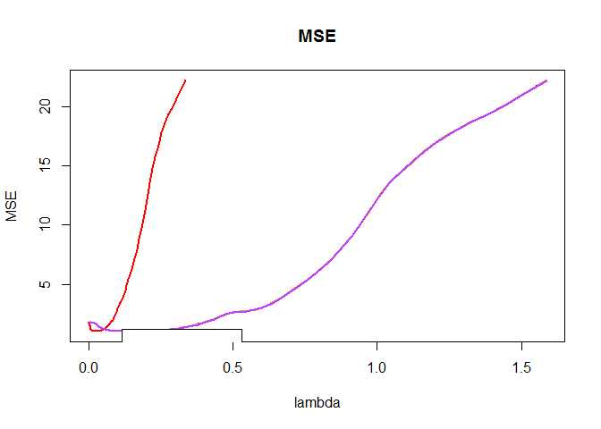

## Introduction

The oem package provides estimaton for various penalized linear models using the [Orthogonalizing EM algorithm](http://amstat.tandfonline.com/doi/abs/10.1080/00401706.2015.1054436). 

Install using the **devtools** package:

```r
#devtools::install_github("jaredhuling/oem")
```

or by cloning and building using `R CMD INSTALL`

## Models

### Lasso


```r
library(microbenchmark)
library(glmnet)
library(oem)
# compute the full solution path, n > p
set.seed(123)
n <- 1000000
p <- 100
m <- 25
b <- matrix(c(runif(m), rep(0, p - m)))
x <- matrix(rnorm(n * p, sd = 3), n, p)
y <- drop(x %*% b) + rnorm(n)

lambdas = oem(x, y, intercept = FALSE, standardize = FALSE)$lambda

microbenchmark(
    "glmnet[lasso]" = {res1 <- glmnet(x, y, thresh = 1e-10, # thresh must be very low for glmnet to be accurate
                                      standardize = FALSE,
                                      intercept = FALSE,
                                      lambda = lambdas)}, 
    "oem[lasso]"    = {res2 <- oem(x, y,  
                                   intercept = FALSE, 
                                   standardize = FALSE,
                                   tol = 1e-10)},
    times = 5
)
```

```
## Unit: seconds
##           expr      min       lq     mean   median       uq      max neval
##  glmnet[lasso] 5.768424 5.813044 5.884797 5.813823 5.970368 6.058325     5
##     oem[lasso] 1.226199 1.230812 1.235265 1.233444 1.235497 1.250374     5
##  cld
##    b
##   a
```

```r
# difference of results
max(abs(coef(res1) - res2$beta[[1]]))
```

```
## [1] 1.594798e-07
```

### MCP


```r
library(sparsenet)
library(ncvreg)
library(plus)
# compute the full solution path, n > p
set.seed(123)
n <- 1000
p <- 200
m <- 50
b <- matrix(c(runif(m, -0.05, 0.05), rep(0, p - m)))
x <- matrix(rnorm(n * p, sd = 3), n, p)
y <- drop(x %*% b) + rnorm(n)


microbenchmark(
    "sparsenet[mcp]" = {res1 <- sparsenet(x, y, thresh = 1e-10, # thresh must be very low for glmnet to be accurate
                                          gamma = c(2,3), #sparsenet throws an error if you only fit 1 value of gamma
                                          nlambda = 200)}, 
    "oem[mcp]"    = {res2 <- oem(x, y,  
                                 penalty = "mcp",
                                 gamma = 2,
                                 intercept = TRUE, 
                                 standardize = TRUE,
                                 nlambda = 200,
                                 tol = 1e-10)},
    "ncvreg[mcp]"    = {res3 <- ncvreg(x, y,  
                                   penalty = "MCP",
                                   gamma = 2,
                                   nlambda = 200,
                                   eps = 1e-10)},
    "plus[mcp]"    = {res4 <- plus(x, y,  
                                   method = "mc+",
                                   gamma = 2,
                                   lam = res2$lambda,
                                   eps = 1e-10)},
    times = 5
)
```

```
## Unit: milliseconds
##            expr       min        lq      mean    median        uq
##  sparsenet[mcp]  540.4850  550.4159  553.3521  553.8224  560.4529
##        oem[mcp]  216.0442  218.7153  223.9168  220.8519  225.5614
##     ncvreg[mcp] 2631.7460 2638.0683 2669.1190 2649.3286 2692.9187
##       plus[mcp]  968.8642  978.1710  997.0174  986.7649 1010.0335
##        max neval  cld
##   561.5842     5  b  
##   238.4112     5 a   
##  2733.5334     5    d
##  1041.2534     5   c
```

```r
x.test <- matrix(rnorm(n * p, sd = 3), n, p)
y.test <- drop(x.test %*% b) + rnorm(n)

spn.preds <- predict(res1, x.test, which.gamma = 1)
oem.preds <- sapply(1:length(res2$lambda), function(i) x.test %*% res2$beta[[1]][-1,i] + res2$beta[[1]][1,i])
ncvreg.preds <- predict(res3, x.test, type = "response")
plus.preds <- t(predict(res4, newx = x.test, lam = res4$lam)$newy)
```

```r
spn.mse    <- apply(spn.preds,    2, function(x) mean((y.test - x) ^ 2))
oem.mse    <- apply(oem.preds,    2, function(x) mean((y.test - x) ^ 2))
ncvreg.mse <- apply(ncvreg.preds, 2, function(x) mean((y.test - x) ^ 2))
plus.mse   <- apply(plus.preds,   2, function(x) mean((y.test - x) ^ 2))

plot(x = res1$lambda[1:150], y = spn.mse[1:150], col = "red", main = "MSE", type = "l",
     ylim = range(spn.mse, oem.mse, ncvreg.mse), lwd = 2, xlab = "lam index", ylab = "MSE")
lines(x = res2$lambda[1:150], y = oem.mse[1:150], col = "blue", lwd = 2)
lines(x = res3$lambda[1:150], y = ncvreg.mse[1:150]-0.0005, col = "darkgoldenrod2", lwd = 2) #make smaller bc of overlap
lines(x = res4$lam[1:150], y = plus.mse[1:150], col = "darkorchid1", lwd = 2)
legend(0.115, 1.185, c("sparsenet", "oem", "ncvreg", "plus"), lty=c(1,1), # gives the legend appropriate symbols (lines)
        lwd=c(2,2,2),col=c("red","blue", "darkgoldenrod2", "darkorchid1"))
```

 


