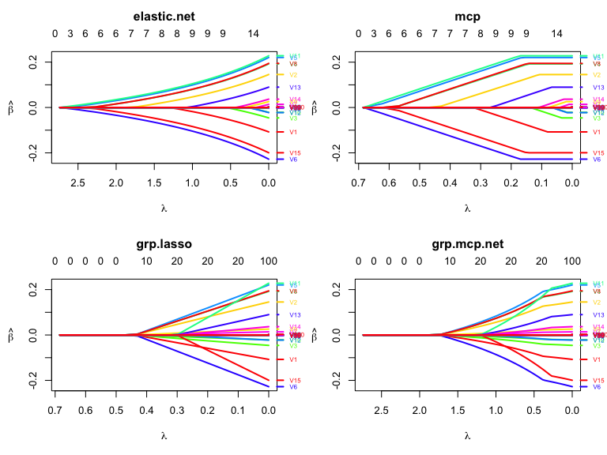

[](https://cran.r-project.org/package=oem)
[](https://travis-ci.org/jaredhuling/oem)
[](https://ci.appveyor.com/project/jaredhuling/oem)

## Introduction

The oem package provides estimation for various penalized linear models
using the [Orthogonalizing EM
algorithm](https://amstat.tandfonline.com/doi/abs/10.1080/00401706.2015.1054436).
Documentation for the package can be found here: [oem
site](https://jaredhuling.org/oem/).

Install using the **devtools** package (RcppEigen must be installed
first as well):

``` r
devtools::install_github("jaredhuling/oem")
```

or by cloning and building using `R CMD INSTALL`

## Citation

To cite oem please use:

Xiong, S., Dai, B., Huling, J., Qian, P. Z. G. (2016) Orthogonalizing
EM: A design-based least squares algorithm, Technometrics, Volume 58,
Pages 285-293,  
<http://dx.doi.org/10.1080/00401706.2015.1054436>.

Huling, J.D. and Chien, P. (2018), Fast Penalized Regression and Cross
Validation for Tall Data with the OEM Package, Journal of Statistical
Software, to appear, URL: <https://arxiv.org/abs/1801.09661>.

## Penalties

### Lasso

``` r
library(microbenchmark)
library(glmnet)
library(oem)
# compute the full solution path, n > p
set.seed(123)
n <- 1000000
p <- 100
m <- 25
b <- matrix(c(runif(m), rep(0, p - m)))
x <- matrix(rnorm(n * p, sd = 3), n, p)
y <- drop(x %*% b) + rnorm(n)

lambdas = oem(x, y, intercept = TRUE, standardize = FALSE, penalty = "elastic.net")$lambda[[1]]

microbenchmark(
    "glmnet[lasso]" = {res1 <- glmnet(x, y, thresh = 1e-10, 
                                      standardize = FALSE,
                                      intercept = TRUE,
                                      lambda = lambdas)}, 
    "oem[lasso]"    = {res2 <- oem(x, y,
                                   penalty = "elastic.net",
                                   intercept = TRUE, 
                                   standardize = FALSE,
                                   lambda = lambdas,
                                   tol = 1e-10)},
    times = 5
)
```

    ## Unit: seconds
    ##           expr      min       lq     mean   median       uq      max neval
    ##  glmnet[lasso] 7.610364 7.622585 7.879448 7.667767 7.945518 8.551005     5
    ##     oem[lasso] 1.969916 2.027118 2.133341 2.089135 2.126875 2.453660     5

``` r
# difference of results
max(abs(coef(res1) - res2$beta[[1]]))
```

    ## [1] 1.048072e-07

``` r
res1 <- glmnet(x, y, thresh = 1e-12, 
               standardize = FALSE,
               intercept = TRUE,
               lambda = lambdas)

# answers are now more close once we require more precise glmnet solutions
max(abs(coef(res1) - res2$beta[[1]]))
```

    ## [1] 3.763397e-09

### Nonconvex Penalties

``` r
library(sparsenet)
library(ncvreg)
library(plus)
# compute the full solution path, n > p
set.seed(123)
n <- 5000
p <- 200
m <- 25
b <- matrix(c(runif(m, -0.5, 0.5), rep(0, p - m)))
x <- matrix(rnorm(n * p, sd = 3), n, p)
y <- drop(x %*% b) + rnorm(n)

mcp.lam <- oem(x, y, penalty = "mcp",
               gamma = 2, intercept = TRUE, 
               standardize = TRUE,
               nlambda = 200, tol = 1e-10)$lambda[[1]]

scad.lam <- oem(x, y, penalty = "scad",
               gamma = 4, intercept = TRUE, 
               standardize = TRUE,
               nlambda = 200, tol = 1e-10)$lambda[[1]]

microbenchmark(
    "sparsenet[mcp]" = {res1 <- sparsenet(x, y, thresh = 1e-10, 
                                          gamma = c(2,3), #sparsenet throws an error 
                                                          #if you only fit 1 value of gamma
                                          nlambda = 200)},
    "oem[mcp]"    = {res2 <- oem(x, y,  
                                 penalty = "mcp",
                                 gamma = 2,
                                 intercept = TRUE, 
                                 standardize = TRUE,
                                 nlambda = 200,
                                 tol = 1e-10)},
    "ncvreg[mcp]"    = {res3 <- ncvreg(x, y,  
                                   penalty = "MCP",
                                   gamma = 2,
                                   lambda = mcp.lam,
                                   eps = 1e-7)}, 
    "plus[mcp]"    = {res4 <- plus(x, y,  
                                   method = "mc+",
                                   gamma = 2,
                                   lam = mcp.lam)},
    "oem[scad]"    = {res5 <- oem(x, y,  
                                 penalty = "scad",
                                 gamma = 4,
                                 intercept = TRUE, 
                                 standardize = TRUE,
                                 nlambda = 200,
                                 tol = 1e-10)},
    "ncvreg[scad]"    = {res6 <- ncvreg(x, y,  
                                   penalty = "SCAD",
                                   gamma = 4,
                                   lambda = scad.lam,
                                   eps = 1e-7)}, 
    "plus[scad]"    = {res7 <- plus(x, y,  
                                   method = "scad",
                                   gamma = 4,
                                   lam = scad.lam)}, 
    times = 5
)
```

    ## Unit: milliseconds
    ##            expr       min        lq      mean    median        uq      max
    ##  sparsenet[mcp] 1762.3026 1779.0533 1907.9942 1871.4751 1954.0494 2173.091
    ##        oem[mcp]  159.3148  159.6247  194.6605  160.0044  238.3018  256.057
    ##     ncvreg[mcp] 7566.5792 7636.3529 7900.8602 7681.1292 7907.0934 8713.146
    ##       plus[mcp] 1625.3785 1692.9125 1703.2951 1694.1239 1711.7150 1792.346
    ##       oem[scad]  136.1331  136.3932  138.6294  137.1140  138.2907  145.216
    ##    ncvreg[scad] 7485.8139 8060.6739 8534.4502 8388.1125 8779.2423 9958.408
    ##      plus[scad] 1765.2935 1873.8984 2009.8369 1878.5176 2097.5155 2433.959

``` r
diffs <- array(NA, dim = c(4, 1))
colnames(diffs) <- "abs diff"
rownames(diffs) <- c("MCP:  oem and ncvreg", "SCAD: oem and ncvreg",
                     "MCP:  oem and plus", "SCAD: oem and plus")
diffs[,1] <- c(max(abs(res2$beta[[1]] - res3$beta)), max(abs(res5$beta[[1]] - res6$beta)),
               max(abs(res2$beta[[1]][-1,1:nrow(res4$beta)] - t(res4$beta))),
               max(abs(res5$beta[[1]][-1,1:nrow(res7$beta)] - t(res7$beta))))
diffs
```

    ##                          abs diff
    ## MCP:  oem and ncvreg 1.725859e-07
    ## SCAD: oem and ncvreg 5.094648e-08
    ## MCP:  oem and plus   2.684136e-11
    ## SCAD: oem and plus   1.732409e-11

### Group Penalties

In addition to the group lasso, the oem package offers computation for
the group MCP, group SCAD, and group sparse lasso penalties. All
aforementioned penalties can also be augmented with a ridge penalty.

``` r
library(gglasso)
library(grpreg)
library(grplasso)
# compute the full solution path, n > p
set.seed(123)
n <- 10000
p <- 200
m <- 25
b <- matrix(c(runif(m, -0.5, 0.5), rep(0, p - m)))
x <- matrix(rnorm(n * p, sd = 3), n, p)
y <- drop(x %*% b) + rnorm(n)
groups <- rep(1:floor(p/10), each = 10)

grp.lam <- oem(x, y, penalty = "grp.lasso",
               groups = groups,
               nlambda = 100, tol = 1e-10)$lambda[[1]]


microbenchmark(
    "gglasso[grp.lasso]" = {res1 <- gglasso(x, y, group = groups, 
                                            lambda = grp.lam, 
                                            intercept = FALSE,
                                            eps = 1e-8)},
    "oem[grp.lasso]"    = {res2 <- oem(x, y,  
                                       groups = groups,
                                       intercept = FALSE,
                                       standardize = FALSE,
                                       penalty = "grp.lasso",
                                       lambda = grp.lam,
                                       tol = 1e-10)},
    "grplasso[grp.lasso]"    = {res3 <- grplasso(x=x, y=y, 
                                                 index = groups,
                                                 standardize = FALSE, 
                                                 center = FALSE, model = LinReg(), 
                                                 lambda = grp.lam * n * 2, 
                                                 control = grpl.control(trace = 0, tol = 1e-10))}, 
    "grpreg[grp.lasso]"    = {res4 <- grpreg(x, y, group = groups, 
                                             eps = 1e-10, lambda = grp.lam)},
    times = 5
)
```

    ## Unit: milliseconds
    ##                 expr        min       lq      mean    median        uq
    ##   gglasso[grp.lasso] 3483.62353 3529.320 3601.1492 3600.3122 3675.7521
    ##       oem[grp.lasso]   99.62382  100.823  107.9303  106.6158  114.8208
    ##  grplasso[grp.lasso] 7105.62106 7409.959 7835.5972 7836.2535 7977.5347
    ##    grpreg[grp.lasso] 1972.84562 2013.477 2132.7026 2015.0525 2149.0820
    ##        max neval
    ##  3716.7380     5
    ##   117.7679     5
    ##  8848.6178     5
    ##  2513.0563     5

``` r
diffs <- array(NA, dim = c(2, 1))
colnames(diffs) <- "abs diff"
rownames(diffs) <- c("oem and gglasso", "oem and grplasso")
diffs[,1] <- c(  max(abs(res2$beta[[1]][-1,] - res1$beta)), max(abs(res2$beta[[1]][-1,] - res3$coefficients))  )
diffs
```

    ##                      abs diff
    ## oem and gglasso  1.303906e-06
    ## oem and grplasso 1.645871e-08

#### Bigger Group Lasso Example

``` r
set.seed(123)
n <- 500000
p <- 200
m <- 25
b <- matrix(c(runif(m, -0.5, 0.5), rep(0, p - m)))
x <- matrix(rnorm(n * p, sd = 3), n, p)
y <- drop(x %*% b) + rnorm(n)
groups <- rep(1:floor(p/10), each = 10)

# fit all group penalties at once
grp.penalties <- c("grp.lasso", "grp.mcp", "grp.scad", 
                   "grp.mcp.net", "grp.scad.net",
                   "sparse.group.lasso")
system.time(res <- oem(x, y, 
                       penalty = grp.penalties,
                       groups  = groups,
                       alpha   = 0.25, # mixing param for l2 penalties
                       tau     = 0.5)) # mixing param for sparse grp lasso 
```

    ##    user  system elapsed 
    ##    3.23    0.17    3.46

### Fitting Multiple Penalties

The oem algorithm is quite efficient at fitting multiple penalties
simultaneously when p is not too big.

``` r
set.seed(123)
n <- 100000
p <- 100
m <- 15
b <- matrix(c(runif(m, -0.25, 0.25), rep(0, p - m)))
x <- matrix(rnorm(n * p, sd = 3), n, p)
y <- drop(x %*% b) + rnorm(n)

microbenchmark(
    "oem[lasso]"    = {res1 <- oem(x, y,
                                   penalty = "elastic.net",
                                   intercept = TRUE, 
                                   standardize = TRUE,
                                   tol = 1e-10)},
    "oem[lasso/mcp/scad/ols]"    = {res2 <- oem(x, y,
                                   penalty = c("elastic.net", "mcp", 
                                               "scad", "grp.lasso", 
                                               "grp.mcp", "sparse.grp.lasso",
                                               "grp.mcp.net", "mcp.net"),
                                   gamma = 4,
                                   tau = 0.5,
                                   alpha = 0.25,
                                   groups = rep(1:10, each = 10),
                                   intercept = TRUE, 
                                   standardize = TRUE,
                                   tol = 1e-10)},
    times = 5
)
```

    ## Unit: milliseconds
    ##                     expr      min       lq     mean   median       uq
    ##               oem[lasso] 214.3171 218.2459 225.8759 219.6271 226.8682
    ##  oem[lasso/mcp/scad/ols] 253.8738 255.8601 279.3674 272.4458 276.6489
    ##       max neval
    ##  250.3211     5
    ##  338.0085     5

``` r
#png("../mcp_path.png", width = 3000, height = 3000, res = 400);par(mar=c(5.1,5.1,4.1,2.1));plot(res2, which.model = 2, main = "mcp",lwd = 3,cex.axis=2.0, cex.lab=2.0, cex.main=2.0, cex.sub=2.0);dev.off()
#

layout(matrix(1:4, ncol=2, byrow = TRUE))
plot(res2, which.model = 1, lwd = 2,
     xvar = "lambda")
plot(res2, which.model = 2, lwd = 2,
     xvar = "lambda")
plot(res2, which.model = 4, lwd = 2,
     xvar = "lambda")
plot(res2, which.model = 7, lwd = 2,
     xvar = "lambda")
```


